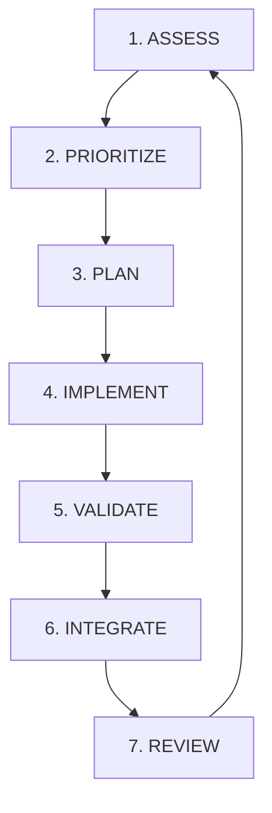

# ArtifactsMMO AI Player - Implementation Loop

## Overview
This document defines the iterative development loop for implementing and debugging the ArtifactsMMO AI Player. Each iteration follows a 7-phase cycle that can be repeated until the AI reaches level 45 autonomously.

**Current Status** (ALWAYS UPDATE): `docs/CURRENT_STATUS.md`
**Reference Plan**: `docs/plans/PLAN_debug_and_implement_ai_player.md`

## Context
- assessment_report.md

## The Loop Structure



---

## Phase 1: ASSESS (Current State Diagnosis)

### Objectives
- Understand current system state
- Identify failures and blockers
- Collect performance metrics

### Actions
```bash
# Run comprehensive diagnostics
uv run python -m src.cli.main diagnose-state test_character --validate-enum
uv run python -m src.cli.main diagnose-actions --list-all --show-costs
uv run python -m src.cli.main diagnose-plan test_character "gain xp" --verbose

# Check test status
uv run pytest tests/ --tb=short --q | grep -E "(passed|failed|error)"

# Review error logs
tail -n 100 debug_output.txt 2>/dev/null || echo "No debug output yet"
```

### Sub-agent Task
```bash
# Use qa-engineer to analyze diagnostic output
/task qa-engineer "Review diagnostic output and identify top 3 critical issues blocking progress"
```

### Decision Criteria
- If critical errors exist → Fix them first
- If tests failing > 10% → Focus on test fixes
- If core functionality broken → Prioritize repair
- Otherwise → Continue to feature implementation

### Output
- `assessment_report.md` with findings
- Priority list of issues to address

---

## Phase 2: PRIORITIZE (Task Selection)

### Objectives
- Select highest-value task from backlog
- Balance fixes vs features
- Consider dependencies

### Priority Matrix
| Priority | Category | Criteria |
|----------|----------|----------|
| P0 | Critical Fix | System non-functional |
| P1 | Core Feature | Required for basic operation |
| P2 | Enhancement | Improves efficiency |
| P3 | Optimization | Performance/polish |

### Current Backlog Reference
1. **🔴 Critical Issues**
   - Crafting Goal failure (see `docs/FIX_CRAFTING_GOAL.md`)
   - Sub-goal architecture bugs
   - Test suite failures

2. **🟡 Refactoring**
   - One class per file (see `docs/plans/PLAN_one_class_per_file.md`)

3. **🟢 Features**
   - Combat system enhancement
   - Resource gathering optimization
   - Grand Exchange integration
   - Banking system

### Selection Process
```python
# Pseudo-code for priority selection
if critical_errors_exist():
    return fix_critical_errors()
elif test_coverage < 90:
    return improve_test_coverage()
elif missing_core_features():
    return implement_next_core_feature()
else:
    return optimize_or_enhance()
```

### Output
- Selected task with justification
- Estimated effort (hours)
- Success criteria

---

## Phase 3: PLAN (Implementation Design)

### Objectives
- Define specific implementation approach
- Identify required changes
- Determine testing strategy

### Planning Template
```markdown
## Task: [Selected Task Name]

### Goal
[What we're trying to achieve]

### Approach
1. [Step 1]
2. [Step 2]
3. [Step 3]

### Files to Modify
- [ ] src/file1.py
- [ ] src/file2.py
- [ ] tests/test_file.py

### Testing Strategy
- Unit tests for [components]
- Integration test for [workflow]
- Manual validation of [feature]

### Success Criteria
- [ ] Tests pass
- [ ] No new errors
- [ ] Feature works as expected
```

### Sub-agent Task
```bash
# Use system-architect for design review
/task system-architect "Review implementation plan for [task] and identify risks"
```

### Output
- `implementation_plan.md` for current task
- Risk assessment
- Alternative approaches if applicable

---

## Phase 4: IMPLEMENT (Code Development)

### Objectives
- Execute the planned implementation
- Follow coding standards
- Maintain test coverage

### Implementation Checklist
- [ ] Read existing code first
- [ ] Follow project conventions
- [ ] One class per file rule
- [ ] No inline imports
- [ ] No print statements for fake success
- [ ] Proper error handling (never catch Exception)

### Sub-agent Tasks
```bash
# Choose appropriate sub-agent based on task type
/task developer "Implement [specific feature] following the plan"
# OR
/task maintenance-support "Fix [specific bug] in [module]"
# OR
/task devops-engineer "Optimize [performance issue]"
```

### Common Implementations

#### Fixing Crafting Goal
```python
# Convert to hierarchical sub-goals
# Reference: docs/FIX_CRAFTING_GOAL.md
- MaterialGatheringGoal
- WorkshopMovementGoal
- CraftExecutionGoal
```

#### One Class Per File Refactoring
```bash
# Priority order from plan
1. Split src/ai_player/state/game_state.py
2. Split src/ai_player/actions/__init__.py
3. Update all imports
```

### Output
- Modified source files
- Updated tests
- Implementation notes

---

## Phase 5: VALIDATE (Testing & Verification)

### Objectives
- Ensure implementation works correctly
- Maintain/improve test coverage
- Verify no regressions

### Validation Steps
```bash
# 1. Run specific tests for modified code
uv run pytest tests/test_[module]/ -v

# 2. Run full test suite
uv run pytest tests/ --tb=short

# 3. Check test coverage
uv run pytest --cov=src --cov-report=term-missing

# 4. Run diagnostics
uv run python -m src.cli.main diagnose-state test_character
uv run python -m src.cli.main test-planning --start-level 1 --goal-level 2

# 5. Manual testing if needed
uv run python -m src.cli.main run-character test_character --max-iterations 10
```

### Sub-agent Task
```bash
# Use qa-engineer for thorough testing
/task qa-engineer "Validate [feature] implementation with edge cases"
```

### Success Criteria
- ✅ All tests pass
- ✅ Coverage ≥ 90%
- ✅ No new warnings
- ✅ Diagnostics show improvement
- ✅ Manual testing successful

### Failure Recovery
- If tests fail → Fix immediately
- If coverage drops → Add tests
- If diagnostics worse → Revert and re-plan

### Output
- Test results report
- Coverage report
- Validation status (PASS/FAIL)

---

## Phase 6: INTEGRATE (Merge & Document)

### Objectives
- Merge changes cleanly
- Update documentation
- Record progress

### Integration Steps
```bash
# 1. Update documentation
echo "## $(date +%Y-%m-%d) - [Task Name]" >> docs/IMPLEMENTATION_PROGRESS.md
echo "- Implemented: [description]" >> docs/IMPLEMENTATION_PROGRESS.md
echo "- Tests: [status]" >> docs/IMPLEMENTATION_PROGRESS.md
echo "- Next: [what's next]" >> docs/IMPLEMENTATION_PROGRESS.md

# 2. Update architecture docs if needed
# Edit docs/ARCHITECTURE.md if structural changes made

# 3. Commit changes (if requested by user)
git add -A
git commit -m "feat: [brief description of change]"
```

### Documentation Updates
- [ ] Update `IMPLEMENTATION_PROGRESS.md`
- [ ] Update `ARCHITECTURE.md` if needed
- [ ] Update `README.md` if API changed
- [ ] Update inline docstrings
- [ ] Update test documentation

### Output
- Updated documentation
- Progress report
- Git commit (if requested)

---

## Phase 7: REVIEW (Analysis & Next Steps)

### Objectives
- Analyze iteration results
- Learn from successes/failures
- Prepare for next iteration

### Review Questions
1. Did we achieve the iteration goal?
2. What unexpected issues arose?
3. What worked well?
4. What should we do differently?
5. Are we closer to level 45 autonomy?

### Metrics to Track
```python
metrics = {
    "iteration_number": N,
    "task_completed": "name",
    "tests_passing": "X%",
    "coverage": "Y%",
    "new_features": ["list"],
    "bugs_fixed": ["list"],
    "time_spent": "hours",
    "blocking_issues": ["list"]
}
```

### Progress Assessment
```bash
# Check overall progress toward level 45
uv run python -m src.cli.main test-planning --start-level 1 --goal-level 45

# Estimate completion
# Phase 1-2: Foundation (20%)
# Phase 3-4: Core Systems (40%)
# Phase 5-6: Advanced Features (60%)
# Phase 7: Integration (70%)
# Phase 8: Advanced (80%)
# Phase 9: Optimization (90%)
# Phase 10: Validation (100%)
```

### Next Iteration Planning
- Review priority backlog
- Update estimates based on velocity
- Identify dependencies
- Schedule next session

### Output
- Review summary
- Updated backlog
- Next iteration recommendation

---

## Quick Start for New Session

```bash
# 1. Check where we left off
cat docs/IMPLEMENTATION_PROGRESS.md | tail -20

# 2. Run assessment
uv run python -m src.cli.main diagnose-state test_character

# 3. Check tests
uv run pytest tests/ --tb=short --q

# 4. Continue from appropriate phase
# - If errors → Start at Phase 1 (ASSESS)
# - If planning needed → Start at Phase 2 (PRIORITIZE)
# - If mid-task → Start at Phase 4 (IMPLEMENT)
# - Otherwise → Start at Phase 7 (REVIEW)
```

---

## Emergency Procedures

### System Completely Broken
```bash
# Reset to last known good state
git status
git diff
git stash  # Save current work
git checkout -- .  # Revert all changes
# OR
git reset --hard HEAD  # Nuclear option
```

### Tests Massively Failing
```bash
# Focus on one test file at a time
uv run pytest tests/test_game_data/test_api_client.py -v
# Fix incrementally
```

### Lost Context
```bash
# Review recent work
git log --oneline -10
cat docs/IMPLEMENTATION_PROGRESS.md
ls -la docs/plans/
```

---

## Success Indicators

### Per Iteration
- ✅ At least one task completed
- ✅ Tests still passing
- ✅ Coverage maintained/improved
- ✅ Documentation updated

### Overall Progress
- ✅ Critical issues resolved
- ✅ Core features implemented
- ✅ AI can operate autonomously
- ✅ Reaches progressively higher levels
- ✅ Eventually achieves level 45

---

## Loop Termination

The loop continues until:
1. AI reaches level 45 autonomously
2. All planned features implemented
3. System is stable and performant
4. Documentation is complete

At that point, shift to maintenance mode with less frequent iterations focused on optimization and bug fixes.

---

## Notes

- Each iteration should take 2-4 hours
- Commit frequently (when requested)
- Ask for help when blocked
- Celebrate small wins
- Learn from failures
- Keep momentum going

**Remember**: Progress > Perfection. Keep iterating!
